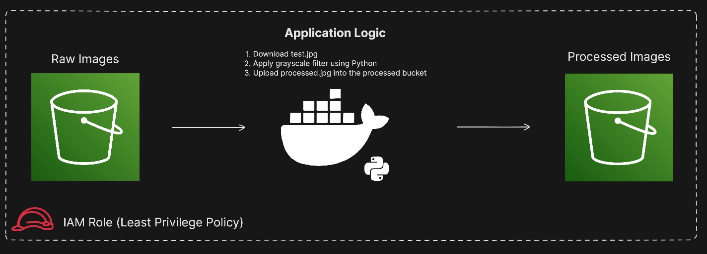

# AWS Automated Image Processor 
A cloud-native, containerized Python application that automates image transformation using AWS S3 and Docker. This project demonstrates Infrastructure as Code (IaC) principles, least-privilege security, and cost-optimized cloud storage.

## 🏗️ Architecture

* Infrastructure: Provisioned via Terraform (HCP Cloud).
* Storage: AWS S3 (Raw & Processed buckets) with 24-hour automated lifecycle cleanup.
* Security: IAM Roles with stand-alone managed policies (No long-term IAM User keys used).
* Compute: Containerized Python (Pillow/Boto3) running as a non-privileged user.

## 🛡️ Security Features
* Least Privilege: Custom IAM policy allows only GetObject and PutObject on specific project buckets—zero access to the rest of the AWS account.
* Container Hardening: Dockerfile implements a non-root appuser to prevent privilege escalation attacks.
* Cost Management: Automated S3 Lifecycle rules ensure a near-zero cost footprint by purging test data daily.

## 🚀 Technical Stack
* Cloud: AWS (S3, IAM)
* IaC: Terraform
* Containerization: Docker
* Language: Python 3.11 (Boto3, Pillow)

## 🛠️ How to Run
### 1. Infrastructure:
```bash
cd terraform
terraform init
terraform apply
```
### 2. Docker Build:
```bash
docker build -t image-processor .
```
### 3: Run Container
```bash
docker run -e UPLOAD_BUCKET="your-bucket" -e PROCESSED_BUCKET="your-processed-bucket" image-processor
```